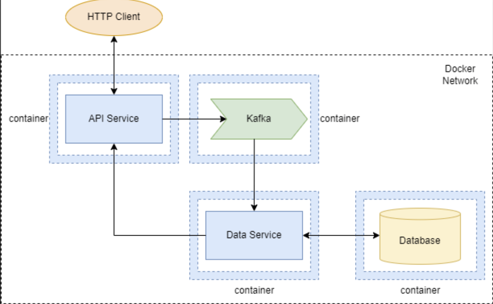

# Restaurant Reviews – микросервисная система сбора отзывов о ресторанах

## Описание проекта

**Restaurant Reviews** – это backend-система, построенная на микросервисной архитектуре, позволяющая пользователям оставлять отзывы о ресторанах, искать их и получать аналитические отчёты.  
Проект демонстрирует взаимодействие следующих компонентов:

- **API Service** – внешний шлюз, принимающий HTTP-запросы, отправляющий новые отзывы в Kafka и проксирующий поиск/отчёты к Data Service.
- **Data Service** – внутренний сервис, который потребляет сообщения из Kafka, сохраняет отзывы в PostgreSQL и предоставляет внутреннее HTTP API для поиска и отчётов.
- **Apache Kafka** – брокер сообщений, обеспечивающий асинхронную передачу отзывов.
- **PostgreSQL** – реляционная база данных с двумя таблицами: `restaurants` и `reviews` (связаны внешним ключом).

Реализованы **три отчёта**:
1. Топ‑10 ресторанов по среднему рейтингу.
2. Количество отзывов по дням (за последние 30 дней).
3. Топ‑10 ресторанов по количеству отзывов.

Все компоненты запускаются в отдельных Docker-контейнерах, объединённых в общую сеть, управление производится через `docker-compose.yml`.

## Технологический стек

- **Java 17** + **Spring Boot 3.4.4**
- **Spring Data JPA**, **Hibernate**
- **PostgreSQL 15** (в контейнере)
- **Apache Kafka** + **ZooKeeper**
- **Spring Kafka** (producer / consumer)
- **Spring Boot Actuator** (health, info, metrics)
- **Validation API** (Hibernate Validator)
- **Lombok**, **SLF4J**
- **Docker**, **Docker Compose** (многоступенчатая сборка)

## Структура проекта

```
cc3-kafka/
├── api-service/
│   ├── Dockerfile
│   ├── pom.xml
│   └── src/main/
│       ├── java/xyz/vanez/
│       │   ├── ApiApplication.java
│       │   ├── controller/ApiController.java
│       │   ├── dto/ReviewRequest.java
│       │   ├── error/
│       │   │   ├── GlobalExceptionHandler.java
│       │   │   └── dto/ErrorResponse.java
│       │   └── service/
│       │       ├── DataServiceClient.java
│       │       └── KafkaProducerService.java
│       └── resources/application.yaml
├── data-service/
│   ├── Dockerfile
│   ├── pom.xml
│   └── src/main/
│       ├── java/xyz/vanez/
│       │   ├── DataApplication.java
│       │   ├── controller/DataController.java
│       │   ├── dto/
│       │   │   ├── MostActiveRestaurantDto.java
│       │   │   ├── ReviewRequest.java
│       │   │   ├── ReviewsByDayDto.java
│       │   │   └── TopRatedRestaurantDto.java
│       │   ├── error/
│       │   │   ├── GlobalExceptionHandler.java
│       │   │   └── dto/ErrorResponse.java
│       │   ├── model/
│       │   │   ├── Restaurant.java
│       │   │   └── Review.java
│       │   ├── repository/
│       │   │   ├── RestaurantRepository.java
│       │   │   └── ReviewRepository.java
│       │   └── service/
│       │       ├── ReviewConsumerService.java
│       │       └── ReviewService.java
│       └── resources/application.yml
├── bruno-collection/
│   ├── bruno.json
│   ├── Actuator/
│   │   ├── Health Check.bru
│   │   ├── Info.bru
│   │   ├── Metrics.bru
│   │   ├── HTTP Requests Count.bru
│   │   ├── JVM Memory Used.bru
│   │   └── Kafka Producer Records.bru
│   ├── Reports/
│   ├── Rewiews/
│   └── Search/
├── .env
├── .gitignore
├── Diagram.png
├── docker-compose.yaml
└── README.md
```

## Запуск

1. **Клонируйте репозиторий**  
   ```bash
   git clone <your-repo-url>
   cd cc3-kafka
   ```

2. **Создайте файл `.env`** в корне проекта (пример):  
   ```ini
   # Версии образов
   ZOOKEEPER_VERSION=7.4.0
   KAFKA_VERSION=7.4.0
   POSTGRES_VERSION=15-alpine

   # PostgreSQL
   POSTGRES_DB=restaurantdb
   POSTGRES_USER=user
   POSTGRES_PASSWORD=your_strong_password
   POSTGRES_PORT_HOST=5432

   # Kafka
   KAFKA_PORT_HOST=9092
   KAFKA_BROKER_ID=1
   KAFKA_OFFSETS_TOPIC_REPLICATION_FACTOR=1
   KAFKA_ADVERTISED_HOST=kafka
   KAFKA_ADVERTISED_PORT=9092

   # API Service
   API_SERVICE_PORT_HOST=8080
   API_SERVICE_PORT_CONTAINER=8080
   SPRING_PROFILES_ACTIVE=docker
   DATA_SERVICE_URL=http://data-service:8081

   # Data Service (порт только внутри сети)
   DATA_SERVICE_PORT_CONTAINER=8081

   # Общие настройки
   KAFKA_BOOTSTRAP_SERVERS=kafka:9092
   DB_URL=jdbc:postgresql://postgres:5432/${POSTGRES_DB}
   ```

3. **Запустите контейнеры**  
   ```bash
   docker-compose up --build
   ```
   - API Service доступен по адресу: `http://localhost:8080`
   - Data Service **не имеет внешнего порта** и работает только внутри Docker-сети.

4. **Остановка**  
   ```bash
   docker-compose down
   ```
   Данные PostgreSQL сохраняются в Docker-томе `postgres_data`.

## API Endpoints (API Service – порт 8080)

| Метод | URL | Описание | Пример тела запроса (POST) |
|-------|-----|----------|----------------------------|
| POST | `/api/reviews` | Добавить отзыв (в Kafka) | `{"restaurantName":"Уютное кафе","restaurantAddress":"ул. Пушкина,1","rating":5,"comment":"Очень вкусно!"}` |
| GET | `/api/search?text={text}` | Поиск отзывов по комментарию | – |
| GET | `/api/reports/top-rated` | Топ‑10 по среднему рейтингу | – |
| GET | `/api/reports/reviews-by-day` | Отзывы по дням (30 дней) | – |
| GET | `/api/reports/most-active` | Топ‑10 по количеству отзывов | – |

**Примечание:** Data Service предоставляет внутренние эндпоинты (`/internal/...`), которые вызываются только из API Service и не должны быть доступны извне.

## Примеры запросов (curl)

### 1. Добавление отзыва
```bash
curl -X POST http://localhost:8080/api/reviews \
  -H "Content-Type: application/json" \
  -d '{"restaurantName":"Уютное кафе","restaurantAddress":"ул. Пушкина,1","rating":5,"comment":"Отлично!"}'
```
Ответ: `202 Accepted`

### 2. Поиск по тексту
```bash
curl "http://localhost:8080/api/search?text=отлично"
```

### 3. Топ‑10 по среднему рейтингу
```bash
curl http://localhost:8080/api/reports/top-rated
```
Пример ответа:
```json
[{"restaurantName":"Уютное кафе","averageRating":4.8,"reviewCount":12}]
```

### 4. Отзывы по дням
```bash
curl http://localhost:8080/api/reports/reviews-by-day
```
Пример:
```json
[{"date":"2026-05-01","reviewCount":5},{"date":"2026-05-02","reviewCount":3}]
```

### 5. Топ‑10 активных ресторанов
```bash
curl http://localhost:8080/api/reports/most-active
```
Пример:
```json
[{"restaurantName":"Уютное кафе","reviewCount":42}]
```

## Валидация и обработка ошибок

**Валидация входных данных** через `@Valid` (JSR-380):
- `@NotBlank` – название, адрес, комментарий.
- `@Min(1)`, `@Max(5)` – рейтинг.
- `@Size(max=1000)` – максимальная длина комментария.

**Глобальный обработчик ошибок** (`@RestControllerAdvice`) перехватывает:
- `MethodArgumentNotValidException` → `400 Bad Request` с перечислением полей.
- `RestClientException` → `502 Bad Gateway`.
- Остальные исключения → `500 Internal Server Error` (с логированием).

Пример ответа при валидационной ошибке:
```json
{
  "timestamp": "2026-05-07T10:30:00",
  "status": 400,
  "error": "Validation Error",
  "message": "rating: Рейтинг должен быть от 1 до 5; comment: Комментарий не может быть пустым; ",
  "path": "/api/reviews"
}
```

## Actuator (мониторинг)

Spring Boot Actuator включён **только на API Service** (Data Service не имеет внешних эндпоинтов).

### Доступные эндпоинты API Service

| Эндпоинт | Описание |
|----------|------------------------|
| `/actuator/health` | Статус здоровья (БД, Kafka, диск) |
| `/actuator/info`   | Информация о приложении |
| `/actuator/metrics` | Список всех метрик |
| `/actuator/metrics/http.server.requests` |  Счётчики HTTP‑запросов |
| `/actuator/metrics/jvm.memory.used` |  Используемая память JVM |
| `/actuator/metrics/spring.kafka.template` | Отправлено сообщений в Kafka |

**Примеры запросов:**
```bash
curl http://localhost:8080/actuator/health
curl http://localhost:8080/actuator/metrics/http.server.requests?tag=uri:/api/reviews
```

## Логирование

Используется `@Slf4j` с уровнем `DEBUG` для пакета `xyz.vanez`. Логи выводятся в консоль Docker:
- Отправка/получение сообщений Kafka.
- Входящие HTTP‑запросы.
- Ошибки с полным stack trace.

## Ключевые особенности реализации (Docker)

- ✅ **Docker-сеть** – все сервисы общаются по именам контейнеров.
- ✅ **Наружу открыт только порт 8080** (API Service). Data Service **не имеет внешнего порта**.
- ✅ **Volume** – `postgres_data` для сохранения данных PostgreSQL.
- ✅ **Все пароли и настройки в `.env`** (файл в `.gitignore`).
- ✅ **Многоступенчатая сборка** – Maven → JRE (лёгкий образ).
- ✅ **Healthcheck для PostgreSQL** – Data Service стартует только после готовности БД.
- ✅ **SERVER_PORT** явно передан в data-service, чтобы избежать конфликта портов.

## Коллекция запросов для Bruno

В папке `bruno-collection/` находится готовая коллекция для [Bruno](https://www.usebruno.com/).  
Структура коллекции:

```
bruno-collection/
├── bruno.json
├── Actuator/
│   ├── Health Check.bru
│   ├── Info.bru
│   ├── Metrics.bru
│   ├── HTTP Requests Count.bru
│   ├── JVM Memory Used.bru
│   └── Kafka Producer Records.bru
├── Reports/
│   ├── Most Active Restaurants.bru
│   ├── Reviews by Day.bru
│   └── Top Rated Restaurants.bru
├── Rewiews/
│   └── Create Review.bru
└── Search/
    └── Search by Text.bru
```

**Как использовать:**
1. Установите Bruno.
2. Откройте коллекцию: `Open Collection` → выберите папку `bruno-collection`.
3. Создайте окружение с переменной: `baseUrl = http://localhost:8080`.
4. Запустите `docker-compose up`.
5. Выполняйте запросы (сначала добавьте несколько отзывов, затем тестируйте поиск, отчёты и Actuator).

## Схема архитектуры



---

**Проект выполнен в рамках практической работы по Kafka и микросервисам.**  
Все современные подходы (контейнеризация, асинхронное взаимодействие, валидация, мониторинг) применены.